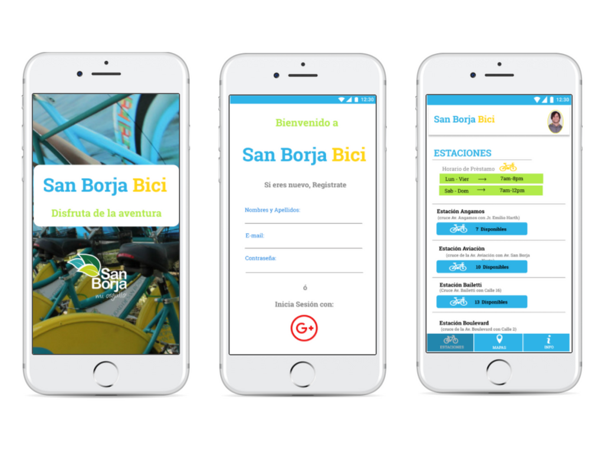
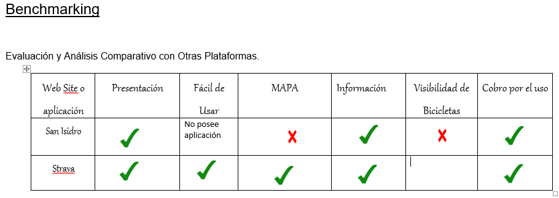
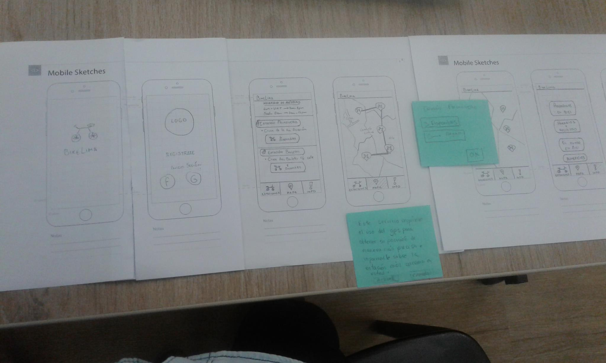
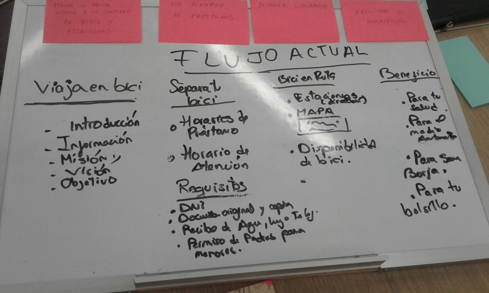
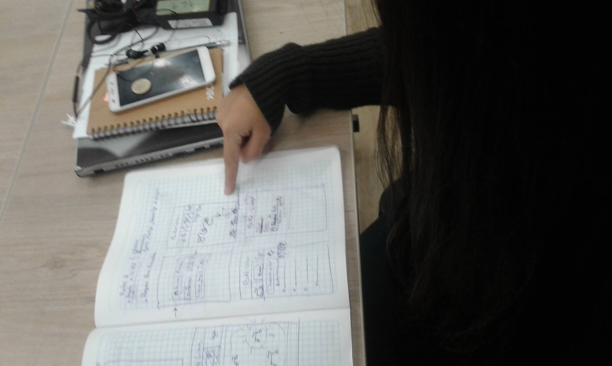
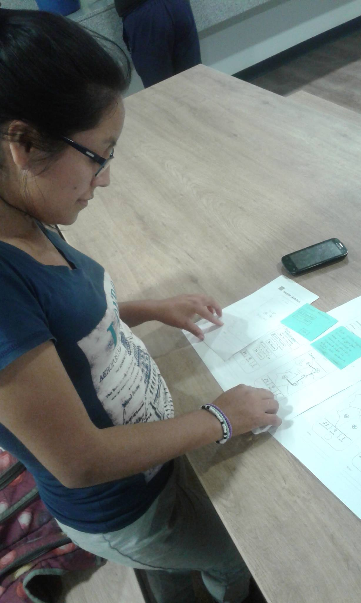
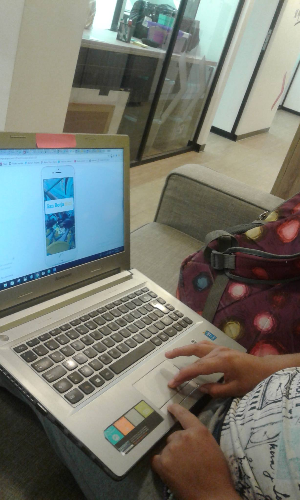
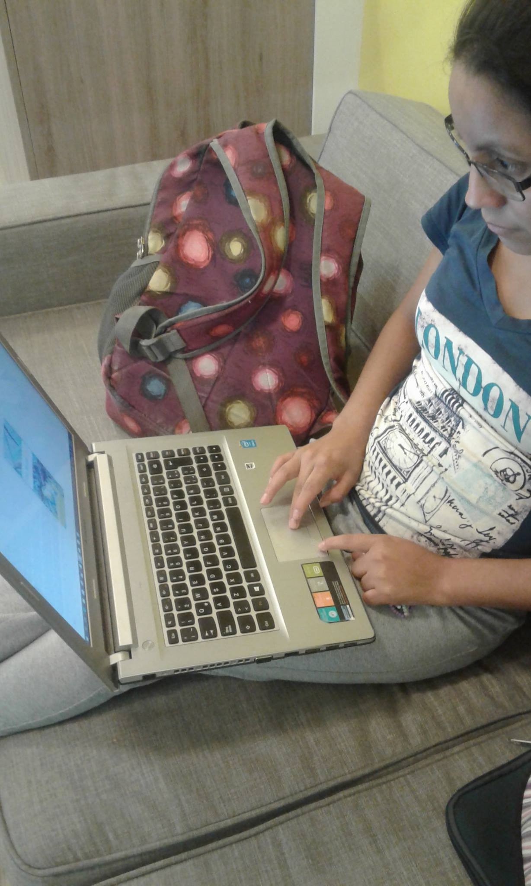

# San Borja Bici

El programa de prestamos de bicicletas del distrito de San Borja, permite a sus vecinos la disposición de bicicletas completamente gratis, una mapa con las estaciones  y las bicicletas disponibles en tiempo real para con ello  generar un impacto ecoamigable y cero contaminación.




##  Equipo de trabajo:

+ Llerena ,Dayan
+  Japa Ozcate Helena
+ Mamani Flores,Gabriela
+ Chavez Loli, Isabel
+ Asto Berrocal, Zulema

## Descripción del reto:

La municipalidad de San Borja tiene un programa de préstamos de bicicletas, implementando la información de sus usuarios de manera efectiva.Con el fin de crear un sistema práctico y facil de usar.

## Objetivo:

Implementar una plataforma que permita a los  usuarios disponer de localización de las estaciones, disponibilidad de bicicletas y puntos de ayuda.

## Desarrollo:

- Para la resolución del reto seguimos las etapas de DCU (Diseño Centrado en el Usuario) y las herramientas de Design Thinking.

### Etapa DCU (Diseño Centrado en el usuario):

### A. Descubrimiento:

**Actividades**

**1.- Entrevista a los usuarios**

Como parte de recabar toda la información de los usuarios hacen uso del programa, obtuvimos los requerimientos y las dificultades que tiene los usuarios  con el producto actual.Adicionalmente se consulto con los miembros del equipo de atención al usuario del distrito recabando información respecto al proceso de inscripción.

**2.- Benchmarking**

Se identificaron plataformas online que ofrecen servicios de préstamo y seguimiento de los usuarios en las ciclovias. Las principales que se encontraron fueron:




- San Isidro es uno de los distritos que tambien promueve el uso de bicicletas como alternativa de  a un medio de transporte que no contamine.

- Strava es una aplicación que genera un seguimiento en la ruta que has escogido adicionalmente te mestra rutas recomendadas que no suelen ser muy seguras.

- Ambas alternativas tienen un cobro por el uso.


### B. Síntesis y definición

**Actividades**

**1.- Definición del problema: Diagrama de afinidad y Lluvia de ideas**

Mediante el diagrama de afinidad se identifió diferentes items de acuerdo a los requerimientos para clasificar los problemas a resolver. Los items fueron:

- Mayor y mejor acceso a la cantidad de bicicletas y Estaciones por parte de los usuarios.
- Control en tiempos de préstamo de bicicletas.
- Facilitar incripción.
- Inicio de sesión.

**2.- Priorización de los items encontrados**

Mediante una lluvia de ideas  con el equipo se priorizaron los siguientes requerimientos:

- Disponibilidad  en la información de bicicletas por estación.
- Visibilidad de un mapa con las estaciones y tu punto de localización.
- Ingreso de usuarios de San Borja Surco y Surquillo mediante un código de identificación.

**3.- Elección del problema**

La  falta de interactividad de la plataforma actual  con sus  usuarios y la red de ciclovias que dispone el distrito.

**4.- Definición del user persona**

Se difinició un user persona principal.


### C. Prototipado

**Actividades**

**1.- Realización del Content Prototype**

- Realización del content prototype del flujo del MVP. Se intentó replicar la interacción del usuario con la plataforma  y como se daría el seguimiento a su ruta.


**Testing con el cliente**

 Luego del testeo del content prototype, se realizó el prototipo del producto en papel definir mejor el flujo y el número de vistas a elaborar por parte del equipo.

**Prototipo**



**Testing con el grupo de trabajo**

- Cambios en los input de llenado de registro.
- Los inputs en la visualización de bicicletas .

Luego de una iteración y corrección de contenido, se testeo con el cliente.




**Testing**

- Cambio en los inputs de registro.
- Adicionar en la información como registrarse más facilmente.






Testing del Prototipo de Alta Fidelidad:






### D. Iteración y Síntesis:

Luego de una nueva deliberación en el equipo y tratar establecer las prioridades del trabajo se determino elaborar un registro sencillo mediante una cuenta de Google.Seguidamente se realizo el proceso de maquetado y elaboración del flujo en prototipo de alta fidelidad.


### F. Flujo de la aplicación.


    https://marvelapp.com/32dd5dd/screen/40386539


### E. Herramientas utilizadas:

* Html5
* CSS
* Javascript
* React js
* Firebase
* Api Google Maps
* Boostrap

### Requisitos

* Node.js
* Npm

### Instalación

```
npm install
```

```
npm start
```
